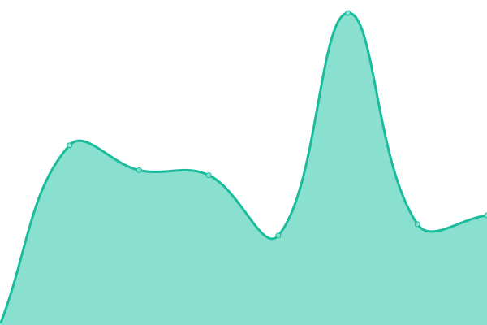
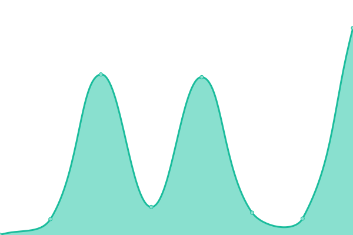
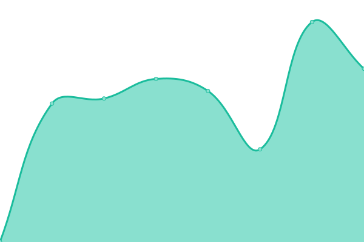
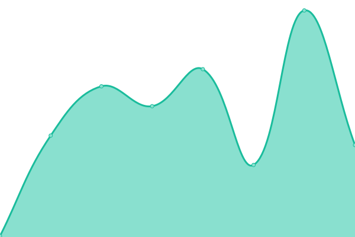

# [📈 Live Status](https://uptime.josemoreira.pt): <!--live status--> **🟧 Partial outage**

This repository contains the open-source uptime monitor and status page for [José Moreira](https://josemoreira.pt), powered by [Upptime](https://github.com/upptime/upptime).

With [Upptime](https://upptime.js.org), you can get your own unlimited and free uptime monitor and status page, powered entirely by a GitHub repository. We use [Issues](https://github.com/giventofly/upptime/issues) as incident reports, [Actions](https://github.com/giventofly/upptime/actions) as uptime monitors, and [Pages](https://uptime.josemoreira.pt) for the status page.

<!--start: status pages-->
<!-- This summary is generated by Upptime (https://github.com/upptime/upptime) -->
<!-- Do not edit this manually, your changes will be overwritten -->
<!-- prettier-ignore -->
| URL | Status | History | Response Time | Uptime |
| --- | ------ | ------- | ------------- | ------ |
|  [bookmarks.josemoreira.pt](https://bookmarks.josemoreira.pt) | 🟩 Up | [bookmarks-josemoreira-pt.yml](https://github.com/giventofly/uptime/commits/HEAD/history/bookmarks-josemoreira-pt.yml) | 

 670ms
     
 | 

<a href="https://uptime.josemoreira.pt/history/bookmarks-josemoreira-pt">100.00%</a>
    

|  [JAM's Bonsai](https://jambonsai.com) | 🟩 Up | [jam-s-bonsai.yml](https://github.com/giventofly/uptime/commits/HEAD/history/jam-s-bonsai.yml) | 

 386ms
     
 | 

<a href="https://uptime.josemoreira.pt/history/jam-s-bonsai">100.00%</a>
    

|  [josemoreira.pt](https://josemoreira.pt) | 🟩 Up | [josemoreira-pt.yml](https://github.com/giventofly/uptime/commits/HEAD/history/josemoreira-pt.yml) | 

 585ms
     
 | 

<a href="https://uptime.josemoreira.pt/history/josemoreira-pt">100.00%</a>
    

|  [Linkding Jam](https://links.josemoreira.pt) | 🟥 Down | [linkding-jam.yml](https://github.com/giventofly/uptime/commits/HEAD/history/linkding-jam.yml) | 

 1340ms
     
 | 

<a href="https://uptime.josemoreira.pt/history/linkding-jam">23.88%</a>
    

|  [outnow](https://outnow.josemoreira.pt) | 🟩 Up | [outnow.yml](https://github.com/giventofly/uptime/commits/HEAD/history/outnow.yml) | 

 783ms
     
 | 

<a href="https://uptime.josemoreira.pt/history/outnow">99.03%</a>
    

|  [redis.josemoreira.pt](https://redis.josemoreira.pt) | 🟩 Up | [redis-josemoreira-pt.yml](https://github.com/giventofly/uptime/commits/HEAD/history/redis-josemoreira-pt.yml) | 

 599ms
     
 | 

<a href="https://uptime.josemoreira.pt/history/redis-josemoreira-pt">100.00%</a>
    

|  [rss.josemoreira.pt](https://rss.josemoreira.pt) | 🟩 Up | [rss-josemoreira-pt.yml](https://github.com/giventofly/uptime/commits/HEAD/history/rss-josemoreira-pt.yml) | 

 1129ms
     
 | 

<a href="https://uptime.josemoreira.pt/history/rss-josemoreira-pt">100.00%</a>
    

|  [screenshots.josemoreira.pt](https://screenshots.josemoreira.pt) | 🟩 Up | [screenshots-josemoreira-pt.yml](https://github.com/giventofly/uptime/commits/HEAD/history/screenshots-josemoreira-pt.yml) | 

 568ms
     
 | 

<a href="https://uptime.josemoreira.pt/history/screenshots-josemoreira-pt">100.00%</a>
    

|  [snek board](https://snekboard.com) | 🟩 Up | [snek-board.yml](https://github.com/giventofly/uptime/commits/HEAD/history/snek-board.yml) | 

 829ms
     
 | 

<a href="https://uptime.josemoreira.pt/history/snek-board">98.80%</a>
    

|  [snek forge](https://snekforge.com) | 🟩 Up | [snek-forge.yml](https://github.com/giventofly/uptime/commits/HEAD/history/snek-forge.yml) | 

 591ms
     
 | 

<a href="https://uptime.josemoreira.pt/history/snek-forge">100.00%</a>
    

|  [stick a snek](https://stickasnek.com) | 🟩 Up | [stick-a-snek.yml](https://github.com/giventofly/uptime/commits/HEAD/history/stick-a-snek.yml) | 

 555ms
     
 | 

<a href="https://uptime.josemoreira.pt/history/stick-a-snek">100.00%</a>
    

|  [stats.stickasnek.com](https://stats.stickasnek.com) | 🟩 Up | [stats-stickasnek-com.yml](https://github.com/giventofly/uptime/commits/HEAD/history/stats-stickasnek-com.yml) | 

 1409ms
     
 | 

<a href="https://uptime.josemoreira.pt/history/stats-stickasnek-com">98.80%</a>
    

|  [suggestions](https://suggestions.josemoreira.pt) | 🟩 Up | [suggestions.yml](https://github.com/giventofly/uptime/commits/HEAD/history/suggestions.yml) | 

 519ms
     
 | 

<a href="https://uptime.josemoreira.pt/history/suggestions">98.80%</a>
    

|  [snek timeline](https://snektimeline.com) | 🟩 Up | [snek-timeline.yml](https://github.com/giventofly/uptime/commits/HEAD/history/snek-timeline.yml) | 

 575ms
     
 | 

<a href="https://uptime.josemoreira.pt/history/snek-timeline">100.00%</a>
    

|  [the pipe stays lit](https://thepipestayslit.com) | 🟩 Up | [the-pipe-stays-lit.yml](https://github.com/giventofly/uptime/commits/HEAD/history/the-pipe-stays-lit.yml) | 

 965ms
     
 | 

<a href="https://uptime.josemoreira.pt/history/the-pipe-stays-lit">98.80%</a>
    

|  [wp.josemoreira.pt](https://wp.josemoreira.pt) | 🟩 Up | [wp-josemoreira-pt.yml](https://github.com/giventofly/uptime/commits/HEAD/history/wp-josemoreira-pt.yml) | 

 854ms
     
 | 

<a href="https://uptime.josemoreira.pt/history/wp-josemoreira-pt">98.80%</a>
    

|  [snekverse](https://snek.josemoreira.pt) | 🟩 Up | [snekverse.yml](https://github.com/giventofly/uptime/commits/HEAD/history/snekverse.yml) | 

 800ms
     
 | 

<a href="https://uptime.josemoreira.pt/history/snekverse">100.00%</a>
    

|  [why snek?](https://whysnek.com) | 🟩 Up | [why-snek.yml](https://github.com/giventofly/uptime/commits/HEAD/history/why-snek.yml) | 

 575ms
     
 | 

<a href="https://uptime.josemoreira.pt/history/why-snek">100.00%</a>
    

|  [snekregret](https://snekregret.com) | 🟩 Up | [snekregret.yml](https://github.com/giventofly/uptime/commits/HEAD/history/snekregret.yml) | 

 405ms
     
 | 

<a href="https://uptime.josemoreira.pt/history/snekregret">100.00%</a>
    

|  [snek forge](https://snekforge.com) | 🟩 Up | [snek-forge.yml](https://github.com/giventofly/uptime/commits/HEAD/history/snek-forge.yml) | 

 591ms
     
 | 

<a href="https://uptime.josemoreira.pt/history/snek-forge">100.00%</a>
    

|  [snek culture](https://snekculture.com) | 🟥 Down | [snek-culture.yml](https://github.com/giventofly/uptime/commits/HEAD/history/snek-culture.yml) | 

 132ms
     
 | 

<a href="https://uptime.josemoreira.pt/history/snek-culture">100.00%</a>
    

<!--end: status pages-->

[**Visit our status website →**](https://uptime.josemoreira.pt)

## 📄 License

- Powered by: [Upptime](https://github.com/upptime/upptime)
- Code: [MIT](./LICENSE) © [Anand Chowdhary](https://anandchowdhary.com), supported by [Pabio](https://pabio.com)
- Data in the `./history` directory: [Open Database License](https://opendatacommons.org/licenses/odbl/1-0/)
